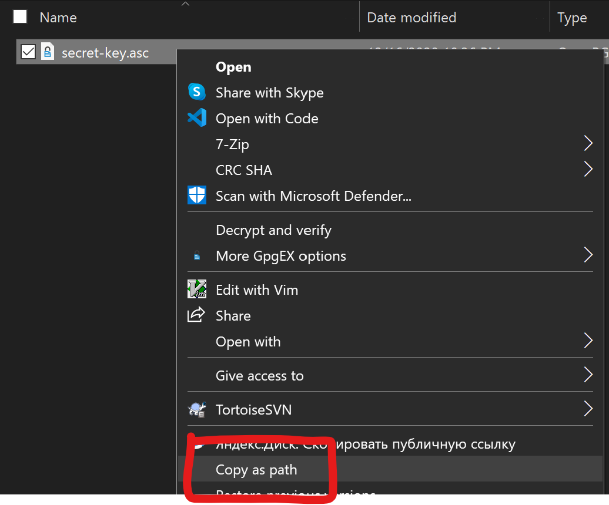

# pass4thewin
pass for the windows platform

Quick (and dirty) clone of [pass](https://passwordstore.org) written in Rust for Windows.
It should be compatible with pass (but no guarantees)

Recommends `git` to be installed for syncing with git remotes, but it is not required.

## Development

Tools required: `rust` and `cargo`. You can use [rustup](https://rustup.rs) to install them.

Run `cargo build` to compile and `cargo run` to run the binary.

## Install

You can find binaries as development goes:

1. Pick the most recent result in the [list of events](https://github.com/x4m3/pass4thewin/actions?query=branch%3Amaster+is%3Asuccess)
2. Download the artifact, it's a zip file containing the binary (x64 only)
3. Place the binary in a folder in your PATH
4. You should be able to run `pass4thewin` in a terminal

## First run

To start using pass4thewin you need to have at least a PGP secret key in a file.

Most users (I think) will be coming from linux, if you are and do not know how to export a PGP secret key you can read [this documentation](https://makandracards.com/makandra-orga/37763-gpg-extract-private-key-and-import-on-different-machine) to learn.

Please place your private key in a location that will always be available, since it is required to decrypt passwords.

Run `pass4thewin init <private-key-path>` to create or detect a password store.
By default this will look in the path `c:\users\username\.password-store`, where `username` is your Windows username.

If you do not know how to get your `<private-key-path>`, find your private key in the file explorer, hold the **Shift** key and right click on the file and select the option `Copy as path`:

Run `pass4thewin init --help` to find all the options of the init command.

## Config file

A config file is used to store:
- the path of the password store
- the path of the pgp key used

When starting, pass4thewin looks for a config file in these 2 locations (in order):
1. In the current path of the binary (run command `Get-Command pass4thewin` to know where)
2. In `%USERPROFILE%\AppData\Roaming\philippeloctaux\pass4thewin\config` (The user's Roaming folder)

pass4thewin can not function without a valid config file. See [First run](#first-run) to generate one.